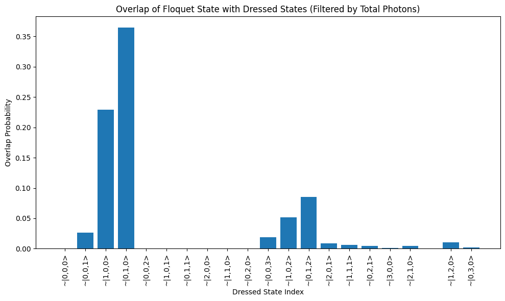

# Aim 
Plot Alice and Bob's modes frequencies as a function of phi_DC

## General Alice Bob Cavity Hamiltonian

Let the Hamiltonian for Alice (A), Bob (B), and a coupler mode (C), all modeled as cavity modes with annihilation operators $a$, $b$, and $c$ and frequencies $\omega_A$, $\omega_B$, $\omega_C$, be:

$$
H = \omega_A\, a^\dagger a + \omega_B\, b^\dagger b + \omega_C\, c^\dagger c  + g_{AC} (a^\dagger c + a c^\dagger) + g_{BC} (b^\dagger c + b c^\dagger)
$$

where:
- $a$, $b$, $c$ are annihilation operators for Alice, Bob, and the coupler mode,
- $a^\dagger$, $b^\dagger$, $c^\dagger$ are the corresponding creation operators,
- $g_{AC}$, $g_{BC}$ are couplings between Alice/Coupler and Bob/Coupler.

## LINC Potential 
$$U = 2M^2E_J \cos{\phi_{ext}}\cos{\theta/M}$$
- $M$: Integer parameter related to the number of junctions or modes in the system  
- $E_J$: Josephson energy  
- $\phi_{ext}$: External flux phase  
- $\theta$: Collective phase variable, e.g., $\theta = \theta_{\mathrm{zpt}} (c + c^\dagger)$  
- $\theta_{\mathrm{zpt}} = (2E_C/E_L)^{1/4}$
- $U$: LINC potential energy

If we set $\phi_{ext} = \frac{\pi}{2} + \phi_{AC}$, then H becomes:
$$
U = 2M^2E_J \sin{\phi_{AC}}\cos{\theta/M}
$$

## Rough strategy for finding frequency shifts 
- Calculate H +V in the 

### Checking that floquet energies don't change with time 

### Choosing the write combination of frequencies is important for doing these simulations
omegac , omegaa, omegaB all gapped by 1 ghz doesn't work 
010 (bob photon) hybridizes strongly with 012

updated to alice bob diff to 500 mhz and now see this for bob photon 

### Driven uncoupled vs dressed 

### With LINC parameters

Below at 0.03 driving strength 

Below at 0.005 driving strength

Below at 0.001 driving strength 

### Main Results 

